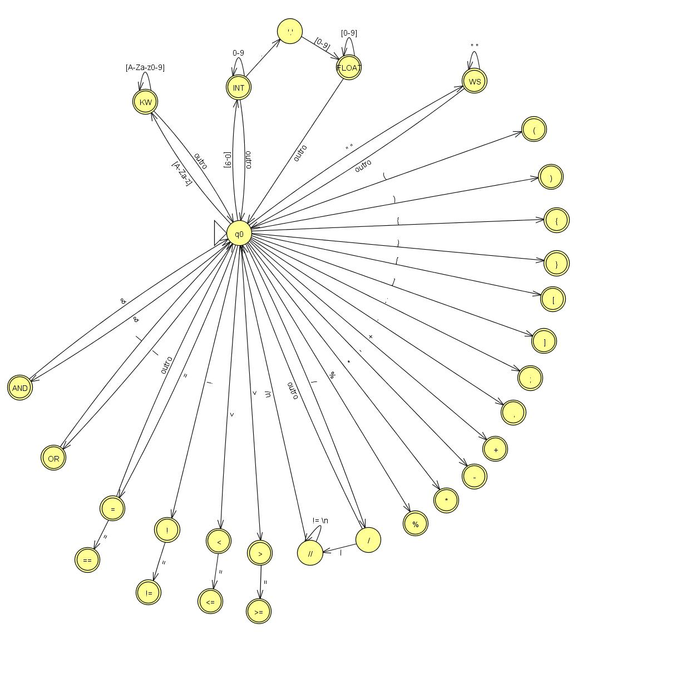

# Analisador Léxico em Python

Este projeto tem como objetivo implementar um analisador léxico (lexer) em Python 3, capaz de ler um arquivo de código-fonte e produzir uma sequência de tokens válidos.  


---
## Autores
- **João Victor Domingos e Souza** - [John5626]
- **Lorenzo Jordani Bertozzi Luz** - [LorenzoBertozzi]
- **Marcela Gomes Pinheiro** - [marcelagomes1]

---
## Descrição

O analisador irá reconhecer categorias de tokens como:
- Identificadores
- Números (inteiros e reais)
- Operadores e delimitadores
- Palavras-reservadas
- Comentários e espaços em branco (descartados)

---
## AFD

O AFD foi criado utilizando o JFLAP para facilitar a visualização e o entendimento do funcionamento do analisador léxico. O arquivo JFLAP pode ser encontrado na pasta `docs/`.

---
## Pré-requisitos
- Python 3.10 ou superior
- pip (gerenciador de pacotes do Python)
- JFLAP (opcional, para visualizar o AFD)

---

## Estrutura do Projeto
```bash
LFA_TPI_2025_1/
├── README.md
├── docs/
├── src/
│   ├── /imports/
│   │       ├── loadToken.py
│   ├── Tokens.py
│   ├── token.txt
├── tests/
├── .gitignore
```

---

## Como Executar

1. Clone este repositório e entre na pasta:
    ```bash
      git clone <https://github.com/John5626/LFA_TPI_2025_1> && cd LFA_TPI_2025_1

2. (Opcional) Crie e ative um ambiente virtual::
    ```bash
    python -m venv .venv
    source .venv/bin/activate
   
3. Rode o programa:
    ```bash
      python main.py
    ```
    

---
## Cronograma de Desenvolvimento (até 20/06)
| Check   | Sprint       | Período       | Objetivos principais                                                                                                                          |
|---------|--------------|---------------|-----------------------------------------------------------------------------------------------------------------------------------------------|
| - [ X ] | **Sprint 1** | 07/05 – 16/05 | - Levantamento de requisitos e tipos de token<br>- Desenho do AFD (diagrama)<br>- Setup mínimo do repositório e pastas principais             |
| - [ ]   | **Sprint 2** | 16/05 – 30/05 | - Implementação da leitura de arquivo e ponteiro de caracteres<br>- Codificação das transições do AFD <br>- Buffer de lexema e mudança de estados |
| - [ ]   | **Sprint 3** | 30/05 – 16/06 | - Emissão de tokens com tipo, valor e posição<br>- Tratamento de espaços e comentários<br>- Desenvolvimento de testes unitários em            |
| - [ ]   | **Sprint 4** | 16/06 – 20/06 | - Documentação final e ajustes no README<br>- Revisão de código e limpeza<br>- Preparação de material de entrega                              |


---
## Ferramentas e Referências Utilizadas
- Python 3.10
- PyCharm
- Git
- JFLAP (Criação do AFD)
